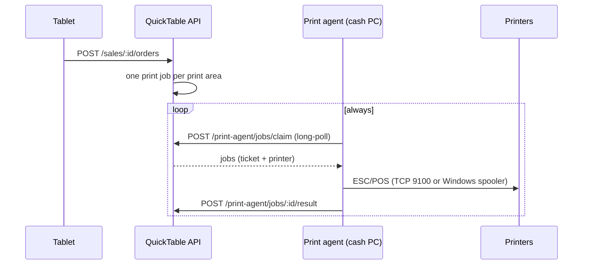

# QuickTable print agent

A small background app for the restaurant's cash PC (Windows). It prints the kitchen and bar tickets
the QuickTable API queues when a guest sends an order from a tablet.

Design and rationale: `quicktable-api/docs/kitchen-printing-design.md`.



## What it does

- **Pairs once** with a restaurant: it shows a code, a manager enters it in the admin
  (Impresión → Vincular PC). No account, no password, no administrator rights.
- **Prints** every job the API hands it and reports the result. A printer that is off fails its
  jobs fast; the API retries them with a backoff.
- **Reports** the printers Windows has installed (every 60 s), so the admin can pick them.
- **Starts with Windows** for the user that installed it, and runs in the background.
- If it is unpaired from the admin, it goes back to showing a pairing code.

Printers are reached in two ways, chosen per printer in the admin:

| Connection | How | For |
|---|---|---|
| `NETWORK` | raw ESC/POS over TCP (`host:9100`) | Ethernet / Wi-Fi printers |
| `WINDOWS` | a RAW job through the Windows spooler | USB, serial or shared printers installed on the PC |

Tickets are rendered for 58 mm (32 characters) or 80 mm (48 characters) paper, in code page PC858.

## Install (restaurant)

1. Download `quicktable-print-agent.exe` and run it.
2. Enter the code it shows in the admin.

The first run copies the program to `%LOCALAPPDATA%\QuickTable\PrintAgent`, sets it to start with
Windows (per user: `HKCU\…\Run`) and starts that copy. Its files live there:

| File | What |
|---|---|
| `quicktable-print-agent.exe` | the installed program |
| `config.json` | the pairing token, encrypted for this Windows user (DPAPI) |
| `agent.log` | what it did (rotated at 5 MB) |

`quicktable-print-agent.exe --uninstall` stops it starting with Windows and forgets the pairing.

## Layout

```
cmd/agent/            entry point: install, single instance, logging, wiring
cmd/virtual-printer/  a fake network printer for development
internal/agent/       pairing, claim loop, heartbeat
internal/api/         client for the API's /print-agent routes
internal/escpos/      ticket → ESC/POS bytes
internal/transport/   TCP 9100 and the Windows spooler; installed printers
internal/config/      state file and token protection
internal/platform/    message box, autostart, single instance
```

## Develop

Needs Go 1.25+.

```bash
go test ./...
```

Run it against a local API without installing it:

```bash
QT_PRINT_AGENT_API_URL=http://localhost:3000 go run ./cmd/agent --no-install --console
```

### No printer? Use the virtual one

`cmd/virtual-printer` listens on TCP like a network printer and shows every ticket it receives as
text, on the console and in `tickets/` (`.txt` as text, `.bin` exactly as sent):

```bash
go run ./cmd/virtual-printer
```

In the admin, add a network printer with address `127.0.0.1:9100` (the agent runs on the same PC).
Stop it to see what a printer that is off looks like: tickets fail, retry and end up as failed.

To exercise the Windows-spooler path too, point a Windows printer at it (PowerShell as
administrator); it then shows up in the admin as a Windows printer:

```powershell
Add-PrinterPort -Name "QT_VIRTUAL" -PrinterHostAddress 127.0.0.1 -PortNumber 9100
Add-PrinterDriver -Name "Generic / Text Only"
Add-Printer -Name "QuickTable Virtual" -DriverName "Generic / Text Only" -PortName "QT_VIRTUAL"
```

Build a release (no console window, API URL baked in):

```bash
./build.sh 0.1.0 https://api.example.com
```

| Flag | |
|---|---|
| `--no-install` | run from where it is, don't copy itself or touch autostart |
| `--console` | also log to the console |
| `--uninstall` | remove autostart and the pairing |
| `--version` | print the version |

`QT_PRINT_AGENT_API_URL` overrides the API URL the binary was built with.

## Not built yet

Signed installer and download from the admin, self-update, tray icon, printer status (paper out,
cover open). See the plan in the design doc.
