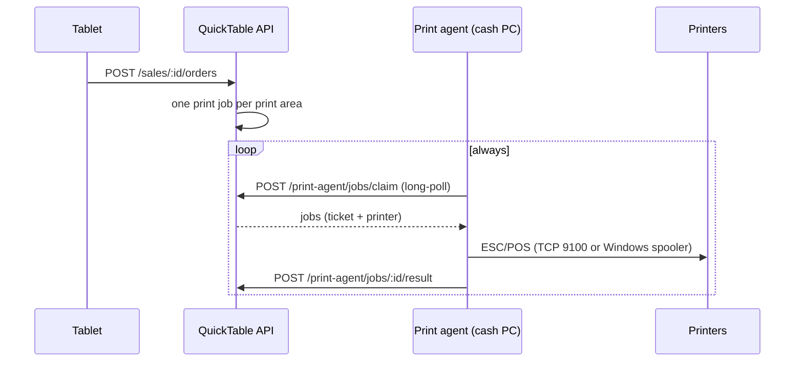

# QuickTable print agent

A small background app for the restaurant's cash PC (Windows). It prints the kitchen and bar tickets
the QuickTable API queues when a guest sends an order from a tablet.

- Design and rationale: `quicktable-api/docs/kitchen-printing-design.md`.
- Installing, releasing and updating: [docs/updates.md](docs/updates.md).



## What it does

- **Installs itself**: the downloaded `.exe` asks, copies itself to the user's folder and starts with
  Windows. No administrator rights. Messages in Spanish (default) or English.
- **Connects on its own**: downloaded from the admin (Impresión → Instalar programa de impresión),
  its file name carries the code that ties it to that restaurant, so nobody types anything. If the
  file lost that name, it asks for the short code the admin shows.
- **Shows it is running**: an icon next to the Windows clock, with the version, the state and the way
  to close it.
- **Prints** every job the API hands it and reports the result. A printer that is off fails its
  jobs fast; the API retries them with a backoff.
- **Reports** the printers Windows has installed (every 60 s): the admin offers them when a printer is
  added — none is added on its own.
- **Updates itself** to the release the API says, after checking its signature, and goes back to the
  version it had if the new one doesn't start.
- If its PC is removed from the admin, it stays installed, unconnected, and asks for a code until it is
  installed again from there.

Printers are reached in two ways, chosen per printer in the admin:

| Connection | How | For |
|---|---|---|
| `NETWORK` | raw ESC/POS over TCP (`host:9100`) | Ethernet / Wi-Fi printers |
| `WINDOWS` | a RAW job through the Windows spooler | USB, serial or shared printers installed on the PC |

Tickets are rendered for 58 mm (32 characters) or 80 mm (48 characters) paper, in code page PC858.

## Layout

```
cmd/agent/            entry point: install/uninstall, single instance, logging, applying an update
cmd/virtual-printer/  a fake network printer for development
internal/agent/       pairing, claim loop, heartbeat, when to update
internal/api/         client for the API's /print-agent routes
internal/escpos/      ticket → ESC/POS bytes
internal/transport/   TCP 9100 and the Windows spooler; installed printers
internal/update/      release signature check, download, swap, revert
internal/i18n/        every message, in Spanish and English
internal/config/      state file and token protection (DPAPI)
internal/platform/    message boxes, the "type the code" window, autostart, installed-apps entry, single instance
internal/tray/        the icon in the Windows notification area
scripts/              release.mjs: build + publish a version · make-icon.py: the tray icon
```

## Develop

Needs Go 1.25+ (and Node 20+ for the release script; `npm install` once).

Everything below is also a VS Code task (**Terminal → Run Task**):

| Task | What |
|---|---|
| Tests | `go test ./...` and the release script's tests |
| Agent: run (local API) | the agent from source against `http://localhost:3000`, not installed, logging to the console |
| Virtual printer | a fake network printer on `127.0.0.1:9100` |
| Agent: build (local) | `dist/quicktable-print-agent.exe` as version `dev` |
| Publish agent | bump the version, test, build and publish — see [docs/updates.md](docs/updates.md) |

By hand:

```bash
go test ./...
```

```bash
QT_PRINT_AGENT_API_URL=http://localhost:3000 go run ./cmd/agent --no-install --console
```

| Flag | |
|---|---|
| `--no-install` | run from where it is: no install, no autostart, no updates |
| `--console` | also log to the console |
| `--lang es\|en` | language of the messages |
| `--uninstall` | remove the agent from this PC |
| `--version` | print the version |

`QT_PRINT_AGENT_API_URL` overrides the API URL the binary was built with. A build's version is `dev`
unless it comes from the release script; a `dev` build never updates itself.

### No printer? Use the virtual one

`cmd/virtual-printer` listens on TCP like a network printer and shows every ticket it receives as
text, on the console and in `tickets/` (`.txt` as text, `.bin` exactly as sent):

```bash
go run ./cmd/virtual-printer
```

In the admin, add a network printer with address `127.0.0.1:9100` (the agent runs on the same PC).
Stop it to see what a printer that is off looks like: tickets fail, retry and end up as failed.

To exercise the Windows-spooler path too, point a Windows printer at it (PowerShell as
administrator); it then shows up in the admin as a Windows printer:

```powershell
Add-PrinterPort -Name "QT_VIRTUAL" -PrinterHostAddress 127.0.0.1 -PortNumber 9100
Add-PrinterDriver -Name "Generic / Text Only"
Add-Printer -Name "QuickTable Virtual" -DriverName "Generic / Text Only" -PortName "QT_VIRTUAL"
```
