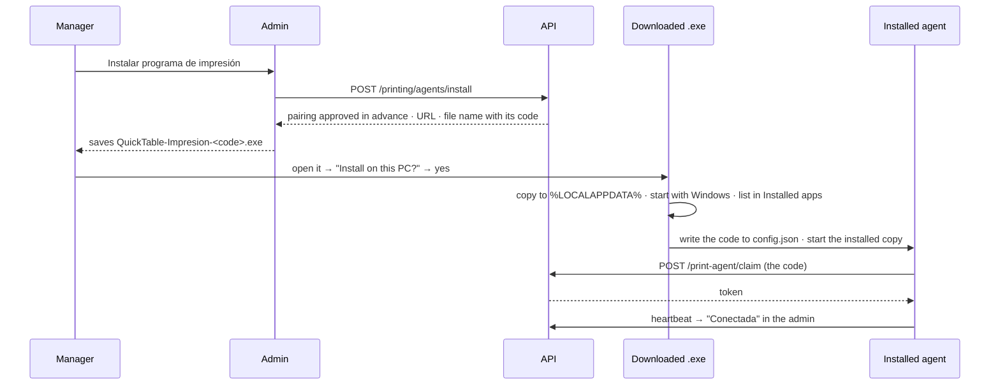
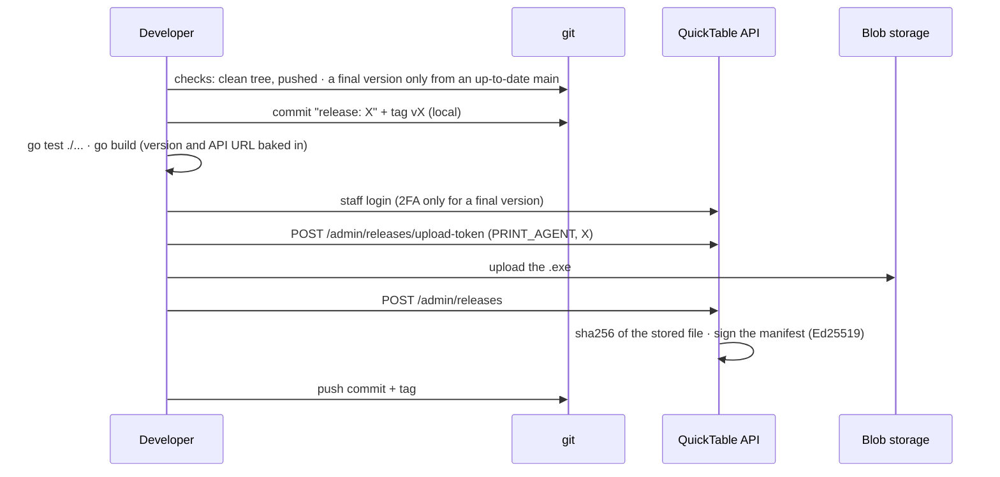
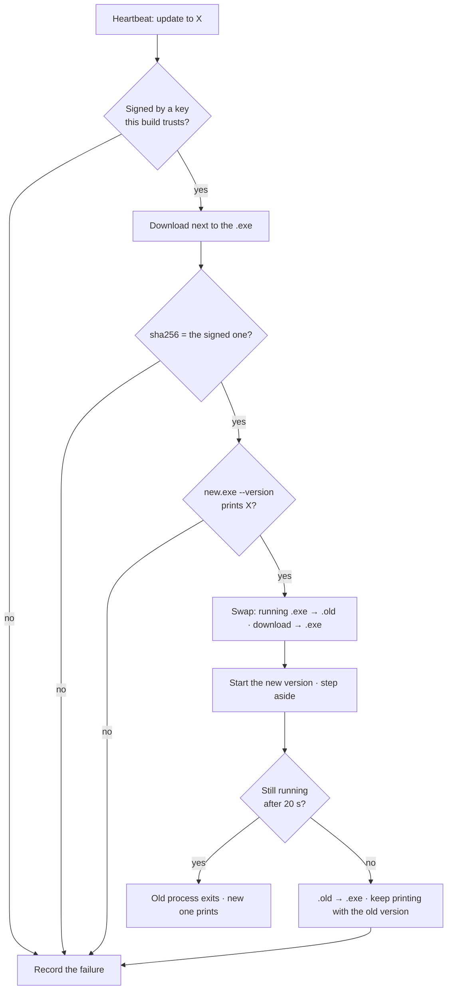

# Installing, releasing and updating the agent

One file does everything: `quicktable-print-agent.exe` is the installer, the agent, the uninstaller
and the updater. There is no separate setup program.

- [Installing](#installing)
- [Releasing a version](#releasing-a-version)
- [How an agent updates](#how-an-agent-updates)
- [Going back](#going-back)
- [The staff console](#the-staff-console)
- [Trying the whole flow locally](#trying-the-whole-flow-locally)
- [Not built](#not-built)

## Installing

What the restaurant does:

1. In the admin: **Impresión → Instalar programa de impresión**. The download is the newest final
   release, saved under a name that ties it to that restaurant.
2. Open the downloaded file and accept. No administrator password, no code to type.

The PC shows up as connected in the admin, and the setup goes on there: areas, then printers.



**How it knows its restaurant.** The program is one generic file. The admin starts an install — an
agent the API ties to that restaurant — and saves the download as `QuickTable-Impresion-<64 hex>.exe`.
The program looks for that code in its own file name (`installCodeInName` in `cmd/agent/install.go`),
keeps it in `config.json`, and its first run trades it for its token (`POST /print-agent/claim`). A
browser adding ` (1)` to the name doesn't matter.

**When the file lost its name** — renamed, sent over a chat — the program can't know its restaurant,
so it **asks for a code**: the short one the admin shows next to the install while it waits ("Si te
pide un código: K7MP Q2XD"). Typing it does the same as the file name would have.

Both codes are good for one hour and for one install. Past that, start the install again in the admin.

**"Ahora no"** on that question leaves the program installed and unconnected; its tray icon says so
and has **Conectar a un restaurante**, which asks again.

**Removing the PC from the admin** leaves the program in that same state, asking for a code. Starting
an install again in the admin gives one — or just open the new download, which replaces the program
already there and connects on its own.

Everything is per user (`HKCU`), which is why no administrator rights are needed:

| What | Where |
|---|---|
| Program, `config.json`, `agent.log` | `%LOCALAPPDATA%\QuickTable\PrintAgent` |
| Start with Windows | `HKCU\Software\Microsoft\Windows\CurrentVersion\Run` → `QuickTablePrintAgent` |
| Installed apps entry | `HKCU\…\Uninstall\QuickTablePrintAgent` (uninstall = the program's own `--uninstall`) |

**The tray icon.** While it runs, the program sits in the Windows notification area (next to the
clock; Windows may tuck it behind the `^` arrow). Its menu shows the version and the state —
connected, no internet, or not connected to a restaurant (then with **Conectar a un restaurante**)
— and **Cerrar**, which first warns that
orders stop printing until it is opened again or the PC restarts. The icon is
`internal/tray/icon.ico`, drawn by `scripts/make-icon.py`.

**Language.** Every message exists in Spanish and English (`internal/i18n`). Spanish is the default;
an English Windows gets English; `--lang es|en` forces one, and an install run with `--lang`
remembers it. The Yes/No buttons are Windows' own.

**Uninstalling.** Windows Settings → Apps → *QuickTable - Agente de impresión* → Uninstall (or
`quicktable-print-agent.exe --uninstall`). It stops the running agent, removes the two registry
entries and deletes the folder, pairing included. The PC still has to be removed in the admin.

**SmartScreen.** The executable isn't code-signed, so Windows shows "Windows protected your PC" the
first time: *More info → Run anyway*. Updates don't go through SmartScreen: the agent downloads them
itself.

## Releasing a version

The agent's version is `"version"` in `package.json`. A release is built and published with one
command, from VS Code (**Terminal → Run Task → Publish agent**) or:

```bash
npm run release -- --bump patch --notes "what changed"
```

It asks which version (`--bump`):

| Bump | Example | Reaches |
|---|---|---|
| `prerelease` | 1.4.2 → 1.4.3-beta.1 → 1.4.3-beta.2 | only the PCs marked "Recibe pruebas" |
| `patch` / `minor` / `major` | 1.4.3-beta.2 → 1.4.3 | **every** PC |
| `none` | publishes the current version | (retry a failed publish) |

What the script does (`scripts/release.mjs`), in order:



If anything fails before the API accepts the release, the local commit and tag are removed.

**There are no rollouts for the agent: publishing is the rollout.** The safe path for a change is
therefore always two steps:

1. Publish a **beta**. It reaches only the PCs marked for test builds (your own, a friendly
   restaurant). Watch it in the staff console.
2. Publish the **final** version (`patch` on a beta finishes it: 1.4.3-beta.2 → 1.4.3).

Publishing by hand is possible too (staff console → Releases → Nueva release → *Agente de
impresión*), but then the file must be built with the version and API URL baked in — the script is
the supported way.

## How an agent updates

Every 60 s the agent sends a heartbeat. The answer says which release it should run (the newest one
not withdrawn; betas only if the PC is marked) and the restaurant's update window — the same one its
tablets use (`Restaurant.updateWindowStartMinute/EndMinute`, 03:00–06:00 by default).

**When.** The agent applies an update when both hold:

- it's **inside the update window** (on the PC's clock), **or the agent started less than 3 minutes
  ago** — so restarting the PC (or the agent) is how someone at the restaurant forces an update; and
- **nothing is waiting to print**: the last time it asked for jobs there were none.

**How.** Each step must pass or the agent stays as it is:



- **Signature.** The API signs each release's *manifest* — channel, version, sha256 — with Ed25519
  (`quicktable-api/docs/release-signing.md`). The agent rebuilds that manifest itself and verifies it
  with the public keys compiled into it (`internal/update/verify.go`, the same keyring the tablets
  carry). A leaked download URL or a tampered file can't get code onto the PC, and an old genuine
  build can't be passed off as another version.
- **Downtime.** A few seconds. Orders placed meanwhile wait in the API's queue and print when the new
  version starts.
- **A failed update** is recorded in `config.json`, reported in the next heartbeats and **not tried
  again**: the agent waits for a different version. A download that fails for lack of network isn't a
  failure until the third attempt.

## Going back

| Situation | What happens |
|---|---|
| The new version doesn't start, or dies within 20 s | Automatic: the agent puts the old `.exe` back and keeps printing. The staff console shows the PC as **Falló**, with the reason. |
| The new version runs but is wrong (prints badly, a bug) | Staff console → Agentes de impresión → **Retirar** that version. Every agent on it goes back to the newest version left, in its window or at its next start. **Restaurar** undoes it. |

Withdrawing is urgent by nature, but agents still wait for their window. To move one now: restart
that PC's agent (sign out and in, or restart the PC).

## The staff console

**Agentes de impresión** (`/staff/print-agents`):

- **Versiones** — every published version, how many PCs run it, which one is *Vigente* (what every
  agent is sent to), and Retirar / Restaurar.
- **PC vinculadas** — every restaurant's PC: version, whether it's up to date / pending / failed (with
  the error), last heartbeat, and the **Recibe pruebas** switch.

The restaurant's own admin (Impresión) only shows whether its PC is connected, its version and, if
an update failed, a notice to contact support.

## Trying the whole flow locally

With the API running locally (`RMS_DRIVER=mock`) and a staff account:

1. The local API signs with its own key, which a normal build doesn't trust. Get its public half
   (from the API's folder, with its `.env` loaded):

   ```bash
   node -e "const c=require('crypto');const k=c.createPrivateKey(Buffer.from(process.env.RELEASE_SIGNING_PRIVATE_KEY_BASE64,'base64').toString());console.log(c.createPublicKey(k).export({type:'spki',format:'der'}).subarray(-32).toString('hex'))"
   ```

2. Publish a beta that trusts it, to the local API (from a pushed branch):

   ```bash
   npm run release -- --api http://localhost:3000 --bump prerelease --trust-key local:<that hex>
   ```

3. In the admin, **Impresión → Instalar programa de impresión**, and open the download.
4. In the staff console mark the PC as **Recibe pruebas**, then publish another beta the same way.
5. Restart the agent (or wait for the window): within a minute it downloads, swaps and restarts.
   `agent.log` in `%LOCALAPPDATA%\QuickTable\PrintAgent` shows each step; the staff console shows the
   new version.
6. **Retirar** that beta: the agent goes back to the previous one.

`go run ./cmd/agent --no-install` never installs or updates — that's for working on the agent itself.

## Not built

- **Code signing (Authenticode).** Needs a certificate (an OV one still warms up SmartScreen
  reputation over time; EV doesn't). Once there is one, `signtool sign` goes in `build()` in
  `scripts/release.mjs`, right after `go build` — the API hashes and signs whatever file it receives,
  so nothing else changes.
- **An "update now" order from the staff console.** Today: the window, or restarting the agent.
